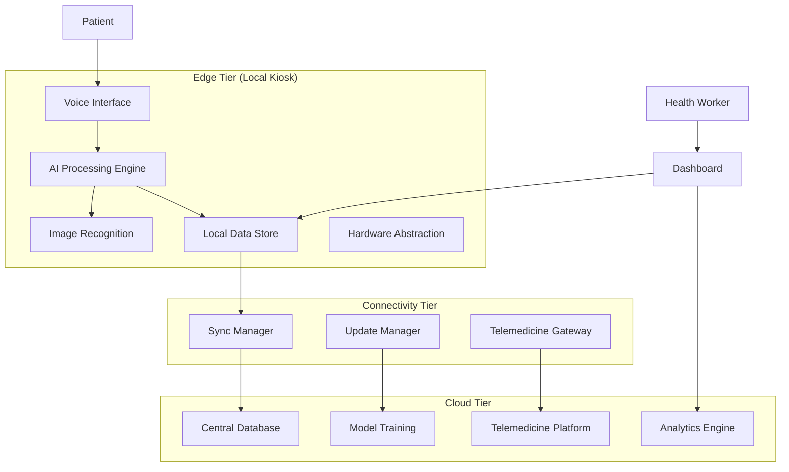

# Design Document: IgnisAI Health Kiosk

## Overview

The IgnisAI Health Kiosk is a comprehensive AI-powered healthcare assistant designed for rural deployment in Bharat. The system combines multiple AI technologies—natural language processing, computer vision, and speech recognition—to provide accessible healthcare services where traditional medical infrastructure is limited.

The architecture follows a modular, edge-first approach that prioritizes offline functionality while maintaining cloud connectivity for enhanced services. The system operates on a patient-centric workflow: initial triage through AI-powered symptom assessment, image-based diagnostics when applicable, and seamless escalation to telemedicine services when professional medical consultation is required.

Key design principles include:
- **Offline-first operation** with cloud synchronization capabilities
- **Modular architecture** enabling independent scaling and updates
- **Multilingual voice-first interface** supporting Hindi and regional languages
- **Privacy-by-design** with end-to-end encryption and local data processing
- **Resource-efficient deployment** suitable for edge devices and smartphones

## Architecture

The system employs a three-tier architecture optimized for edge deployment:

### Edge Tier (Local Kiosk)
- **AI Processing Engine**: Local inference for symptom analysis and image recognition
- **Voice Interface Module**: Offline speech recognition and synthesis
- **Local Data Store**: Encrypted patient data with automatic synchronization
- **Hardware Abstraction Layer**: Support for various deployment platforms

### Connectivity Tier (Network Bridge)
- **Sync Manager**: Intelligent data synchronization with bandwidth optimization
- **Telemedicine Gateway**: Secure connection management for doctor consultations
- **Update Manager**: Over-the-air updates for AI models and system components

### Cloud Tier (Backend Services)
- **Central Health Database**: Aggregated anonymized health data for population insights
- **Model Training Pipeline**: Continuous improvement of AI models based on field data
- **Telemedicine Platform**: Doctor availability management and consultation routing
- **Analytics Engine**: Community health trend analysis and outbreak detection



## Components and Interfaces

### AI Processing Engine

The core intelligence component responsible for symptom analysis and medical decision support.

**Key Responsibilities:**
- Natural language understanding of patient symptoms in multiple languages
- Rule-based and ML-powered triage decision making
- Integration with medical knowledge bases and clinical guidelines
- Confidence scoring and uncertainty handling

**Technical Implementation:**
- Lightweight transformer models optimized for edge deployment (< 500MB)
- Quantized neural networks for efficient inference on ARM processors
- Rule-based fallback systems for high-confidence medical protocols
- Local medical knowledge base covering common rural health conditions

**Interfaces:**
- `analyzeSymptoms(symptoms: MultilingualText, patientContext: PatientProfile): TriageResult`
- `getFollowUpQuestions(currentAssessment: Assessment): Question[]`
- `generateRecommendations(triageResult: TriageResult): MedicalAdvice`

### Voice Interface Module

Multilingual speech processing system optimized for Indian languages and accents.

**Key Responsibilities:**
- Real-time speech recognition in Hindi and 5+ regional languages
- Natural language synthesis with culturally appropriate intonation
- Noise reduction and accent adaptation
- Conversation flow management

**Technical Implementation:**
- Wav2Vec2-based ASR models fine-tuned on Indian accent datasets
- FastSpeech2 TTS models with regional voice characteristics
- Voice Activity Detection (VAD) for noisy environments
- Language identification and code-switching support

**Interfaces:**
- `recognizeSpeech(audioStream: AudioBuffer, language: LanguageCode): TranscriptionResult`
- `synthesizeSpeech(text: string, language: LanguageCode, voice: VoiceProfile): AudioBuffer`
- `detectLanguage(audioStream: AudioBuffer): LanguageCode`

### Image Recognition Module

Computer vision system for basic medical image analysis and diagnostic support.

**Key Responsibilities:**
- Skin condition analysis and dermatological screening
- Basic X-ray abnormality detection
- Image quality assessment and validation
- Confidence scoring and recommendation generation

**Technical Implementation:**
- MobileNetV3-based CNN architectures for efficient edge inference
- Transfer learning from medical imaging datasets (DermNet, ChestX-ray14)
- Image preprocessing pipelines for quality enhancement
- Ensemble methods for improved accuracy and confidence estimation

**Interfaces:**
- `analyzeSkinCondition(image: ImageBuffer): DiagnosticResult`
- `analyzeXRay(image: ImageBuffer, bodyPart: BodyPartType): RadiologyResult`
- `validateImageQuality(image: ImageBuffer): QualityAssessment`

### Telemedicine Gateway

Secure communication bridge connecting patients with remote healthcare professionals.

**Key Responsibilities:**
- Doctor availability management and appointment scheduling
- Secure video/audio communication establishment
- Patient data transmission to consulting physicians
- Session recording and documentation (with consent)

**Technical Implementation:**
- WebRTC-based peer-to-peer communication with STUN/TURN servers
- End-to-end encryption using AES-256 and RSA key exchange
- Adaptive bitrate streaming for low-bandwidth environments
- Integration with existing telemedicine platforms via REST APIs

**Interfaces:**
- `findAvailableDoctor(specialty: MedicalSpecialty, urgency: UrgencyLevel): DoctorAvailability`
- `initiateConsultation(patientId: string, doctorId: string): ConsultationSession`
- `transmitPatientData(sessionId: string, patientData: EncryptedData): TransmissionResult`

### Local Data Store

Encrypted, HIPAA-compliant data management system with offline-first design.

**Key Responsibilities:**
- Secure patient data storage with field-level encryption
- Automatic data synchronization with conflict resolution
- Audit logging and compliance reporting
- Data retention and anonymization policies

**Technical Implementation:**
- SQLite database with SQLCipher encryption
- Event sourcing pattern for data consistency
- Merkle tree-based synchronization for efficient updates
- GDPR/Indian data protection compliance mechanisms

**Interfaces:**
- `storePatientRecord(record: EncryptedPatientRecord): StorageResult`
- `retrievePatientHistory(patientId: string): PatientRecord[]`
- `synchronizeData(cloudEndpoint: string): SyncResult`

### Health Worker Dashboard

Administrative interface for local health workers to monitor and manage community health.

**Key Responsibilities:**
- Real-time patient interaction monitoring
- Referral case management and follow-up tracking
- Community health trend visualization
- Alert management for urgent cases

**Technical Implementation:**
- Progressive Web App (PWA) for cross-platform compatibility
- Real-time data updates using WebSocket connections
- Responsive design optimized for tablets and smartphones
- Role-based access control with multi-factor authentication

**Interfaces:**
- `getDashboardMetrics(timeRange: DateRange): HealthMetrics`
- `getUrgentCases(healthWorkerId: string): UrgentCase[]`
- `generateHealthReport(community: CommunityId, period: TimePeriod): HealthReport`

## Data Models

### Patient Profile
```typescript
interface PatientProfile {
  id: string;
  demographics: {
    age: number;
    gender: Gender;
    location: GeoLocation;
    preferredLanguage: LanguageCode;
  };
  medicalHistory: MedicalCondition[];
  allergies: Allergy[];
  currentMedications: Medication[];
  vitalSigns: VitalSigns;
  riskFactors: RiskFactor[];
  createdAt: Date;
  lastUpdated: Date;
}
```

### Symptom Assessment
```typescript
interface SymptomAssessment {
  id: string;
  patientId: string;
  symptoms: Symptom[];
  duration: Duration;
  severity: SeverityLevel;
  associatedFactors: string[];
  followUpQuestions: QuestionResponse[];
  aiConfidence: number;
  triageCategory: TriageCategory;
  recommendations: MedicalRecommendation[];
  timestamp: Date;
}
```

### Diagnostic Result
```typescript
interface DiagnosticResult {
  id: string;
  patientId: string;
  imageId: string;
  analysisType: DiagnosticType;
  findings: Finding[];
  confidence: number;
  recommendations: string[];
  requiresProfessionalReview: boolean;
  processingTime: number;
  modelVersion: string;
  timestamp: Date;
}
```

### Consultation Session
```typescript
interface ConsultationSession {
  id: string;
  patientId: string;
  doctorId: string;
  sessionType: ConsultationType;
  startTime: Date;
  endTime?: Date;
  status: SessionStatus;
  patientData: EncryptedPatientData;
  doctorNotes: string;
  prescription?: Prescription;
  followUpRequired: boolean;
  recordingConsent: boolean;
}
```

### Health Metrics
```typescript
interface HealthMetrics {
  communityId: string;
  timeRange: DateRange;
  totalConsultations: number;
  urgentCases: number;
  commonConditions: ConditionFrequency[];
  referralRate: number;
  patientSatisfaction: number;
  systemUptime: number;
  averageResponseTime: number;
}
```

## Correctness Properties

*A property is a characteristic or behavior that should hold true across all valid executions of a system—essentially, a formal statement about what the system should do. Properties serve as the bridge between human-readable specifications and machine-verifiable correctness guarantees.*

### Property Reflection

After analyzing all acceptance criteria, several properties can be consolidated to eliminate redundancy:

- **Symptom Analysis Properties (1.1-1.5)**: Can be combined into comprehensive symptom processing properties
- **Image Analysis Properties (2.1-2.5)**: Can be consolidated into image processing and confidence handling properties  
- **Voice Interface Properties (3.1-3.5)**: Can be combined into multilingual voice processing properties
- **Data Security Properties (6.1-6.5)**: Can be consolidated into comprehensive encryption and compliance properties
- **Triage Properties (10.1-10.5)**: Can be combined into workflow and categorization properties

### Core Properties

**Property 1: Comprehensive Symptom Analysis**
*For any* patient symptom description in any supported language, the AI_Engine should analyze the symptoms, generate relevant follow-up questions, and provide preliminary advice that follows established medical protocols
**Validates: Requirements 1.1, 1.2, 1.4, 1.5**

**Property 2: Emergency Detection and Response**
*For any* symptom assessment that indicates emergency conditions, the system should immediately recommend urgent medical attention and alert appropriate health workers
**Validates: Requirements 1.3, 10.3**

**Property 3: Medical Image Processing Pipeline**
*For any* medical image (skin condition or X-ray), the Image_Recognition_Module should validate image quality, perform analysis, provide confidence scores, and recommend professional review when confidence is below threshold
**Validates: Requirements 2.1, 2.2, 2.3, 2.4, 2.5**

**Property 4: Multilingual Voice Interface**
*For any* supported language (Hindi and 5+ regional languages), the Voice_Interface should accurately transcribe speech with 95% accuracy, synthesize natural responses, handle noise appropriately, and provide consistent audio guidance
**Validates: Requirements 3.1, 3.2, 3.3, 3.4, 3.5**

**Property 5: Offline Operation and Synchronization**
*For any* network connectivity state (offline, low-bandwidth, or online), the Health_Kiosk should maintain core functionality, store data locally when needed, and automatically synchronize when connectivity is restored
**Validates: Requirements 4.1, 4.2, 4.3, 4.4, 4.5**

**Property 6: Telemedicine Integration**
*For any* patient assessment requiring professional consultation, the Telemedicine_Gateway should initiate doctor connections, transmit patient data securely, establish communication when doctors are available, or schedule appointments when unavailable
**Validates: Requirements 5.1, 5.2, 5.3, 5.4, 5.5**

**Property 7: Comprehensive Data Security**
*For any* patient data operation (storage, access, transmission, or synchronization), the system should maintain end-to-end encryption, require proper authentication, maintain audit logs, and comply with healthcare data protection regulations
**Validates: Requirements 6.1, 6.2, 6.3, 6.4, 6.5**

**Property 8: Health Worker Dashboard Functionality**
*For any* health worker accessing the dashboard, the system should display real-time statistics, show referral cases with urgency levels, present anonymized patient summaries, generate trend reports, and send notifications for urgent cases
**Validates: Requirements 7.1, 7.2, 7.3, 7.4, 7.5**

**Property 9: Cross-Platform Hardware Compatibility**
*For any* supported hardware platform (dedicated kiosk, Android smartphone, or edge device), the Health_Kiosk should maintain full functionality while optimizing resource usage and meeting storage requirements
**Validates: Requirements 9.1, 9.2, 9.3, 9.4, 9.5**

**Property 10: Structured Triage Workflow**
*For any* patient interaction, the Triage_System should guide structured symptom collection, categorize patients into appropriate care levels (emergency, urgent, routine), and provide care recommendations based on WHO and Indian medical guidelines
**Validates: Requirements 10.1, 10.2, 10.4, 10.5**

**Property 11: Module Backward Compatibility**
*For any* system module update, the Health_Kiosk should maintain backward compatibility with existing functionality and interfaces
**Validates: Requirements 8.5**

## Error Handling

The system implements comprehensive error handling across all components:

### AI Engine Error Handling
- **Symptom Analysis Failures**: Fallback to rule-based assessment when ML models fail
- **Knowledge Base Unavailability**: Local cached protocols for common conditions
- **Confidence Threshold Management**: Automatic escalation when AI confidence is insufficient

### Voice Interface Error Handling
- **Speech Recognition Failures**: Multiple retry attempts with noise filtering
- **Language Detection Errors**: Default to Hindi with manual language selection option
- **Audio Hardware Issues**: Graceful degradation to text-based interaction

### Image Recognition Error Handling
- **Poor Image Quality**: Automatic enhancement attempts with user guidance for recapture
- **Unsupported Image Formats**: Format conversion with quality preservation
- **Analysis Failures**: Immediate referral to professional review with error logging

### Network and Connectivity Error Handling
- **Connection Timeouts**: Automatic retry with exponential backoff
- **Synchronization Conflicts**: Timestamp-based conflict resolution with manual review option
- **Telemedicine Connection Failures**: Queue management with estimated wait times

### Data Security Error Handling
- **Encryption Failures**: System lockdown with secure error reporting
- **Authentication Failures**: Progressive security measures with audit logging
- **Data Corruption**: Automatic backup restoration with integrity verification

## Testing Strategy

The testing approach combines comprehensive unit testing with property-based testing to ensure system reliability and correctness.

### Property-Based Testing Configuration

**Testing Framework**: We will use Hypothesis (Python) for property-based testing, configured to run a minimum of 100 iterations per property test to ensure comprehensive input coverage.

**Test Tagging**: Each property-based test will be tagged with a comment referencing its corresponding design document property:
- Format: `# Feature: ignisai-health-kiosk, Property {number}: {property_text}`

**Property Test Implementation**: Each of the 11 correctness properties will be implemented as a separate property-based test that validates the universal behavior across all valid inputs.

### Unit Testing Strategy

Unit tests will complement property tests by focusing on:

**Specific Examples**: Concrete test cases that demonstrate correct behavior for known scenarios
- Emergency symptom recognition with specific symptom combinations
- Image analysis with known medical images and expected results
- Voice recognition accuracy with recorded speech samples

**Edge Cases**: Boundary conditions and unusual inputs
- Extremely noisy audio environments
- Corrupted or malformed medical images  
- Network connectivity edge cases (intermittent connections, very low bandwidth)

**Integration Points**: Component interaction validation
- AI Engine to Voice Interface communication
- Telemedicine Gateway to external doctor platforms
- Data synchronization between local and cloud storage

**Error Conditions**: Failure scenario handling
- Hardware failures and graceful degradation
- Invalid user inputs and system responses
- Security breach attempts and system protection

### Testing Coverage Requirements

- **Functional Coverage**: All user-facing features tested through both unit and property tests
- **Security Coverage**: All data handling and encryption pathways validated
- **Performance Coverage**: Resource usage and response time validation on target hardware
- **Compatibility Coverage**: Cross-platform functionality verification across all supported devices

The dual testing approach ensures that while property tests validate universal correctness across infinite input spaces, unit tests provide concrete validation of specific scenarios and edge cases critical for healthcare applications.